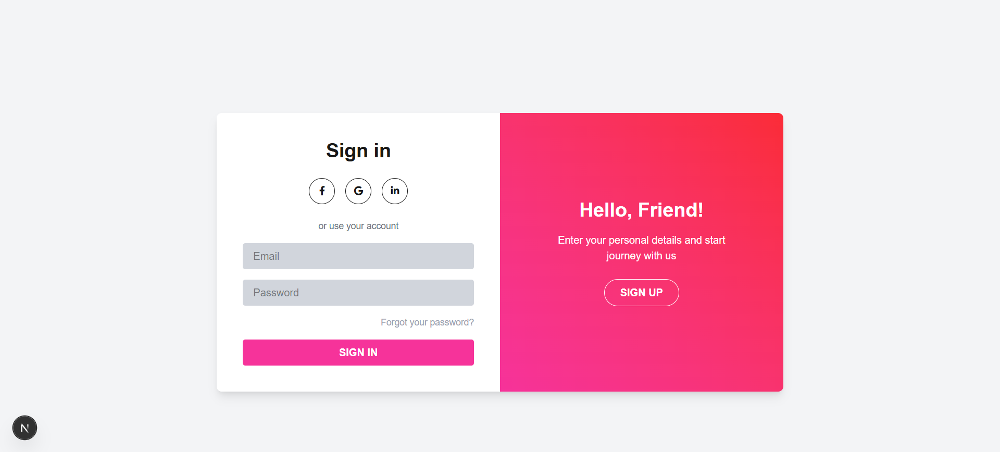
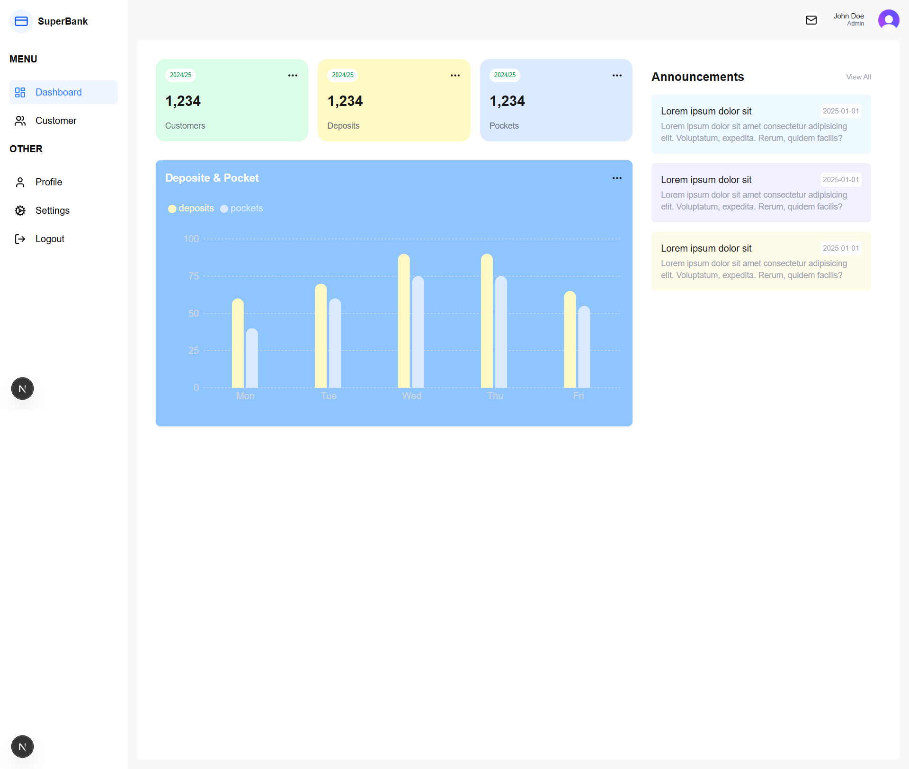
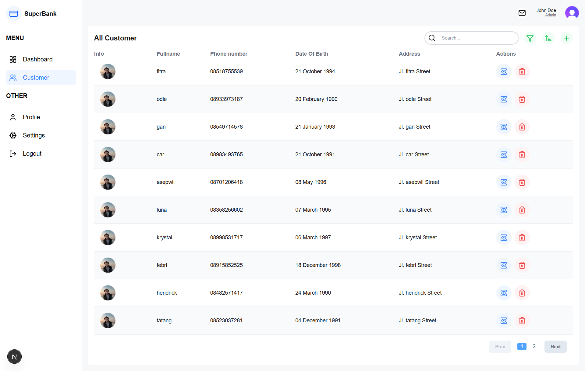
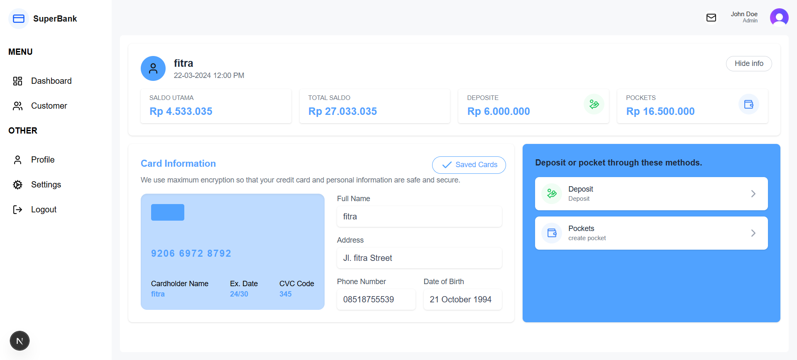

## 🖼️ Screenshots & Explanations

### 1. 🏠 Login Page

**Description:**
Halaman login admin url (http://localhost:3000/login)
- masukan username dan password
- example: username = admin@example.com dan password = today1234

### 1. 🏠 Dashboard

**Description:**
Halaman utama setelah login, menampilkan:
- Total Customers, Deposits, dan Pockets secara real-time
- Grafik perbandingan jumlah deposits dan pockets mingguan
- Pengumuman terbaru di sidebar kanan

---

### 2. 👥 Customer List

**Description:**
Menampilkan daftar seluruh customer dengan fitur:
- Data lengkap seperti nama, nomor telepon, tanggal lahir, dan alamat
- Pencarian dan filter customer
- Aksi edit dan hapus untuk setiap customer
- Navigasi pagination

---

### 3. 🧾 Customer Detail

**Description:**
Menampilkan detail informasi customer yang dipilih:
- Saldo utama, total saldo, deposit, dan pockets
- Informasi kartu yang terenkripsi
- Data profil lengkap customer
- Opsi untuk melakukan deposit atau membuat pocket baru

---

## 📁 Screenshot Folder Structure